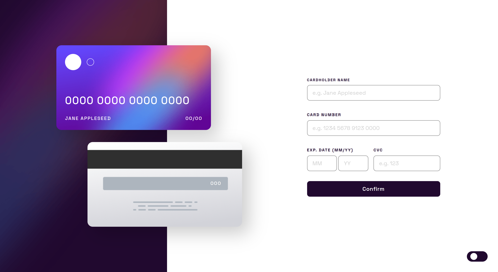
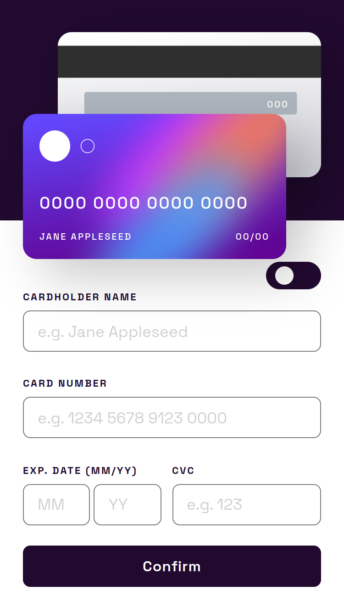

# Frontend Mentor - Interactive card details form solution

This is a solution to the [Interactive card details form challenge on Frontend Mentor](https://www.frontendmentor.io/challenges/interactive-card-details-form-XpS8cKZDWw). Frontend Mentor challenges help you improve your coding skills by building realistic projects. 

## Table of contents

- [Overview](#overview)
  - [The challenge](#the-challenge)
  - [Screenshot](#screenshot)
  - [Links](#links)
- [My process](#my-process)
  - [Built with](#built-with)
  - [What I learned](#what-i-learned)
  - [Continued development](#continued-development)
  - [Useful resources](#useful-resources)
- [Author](#author)

## Overview

### The challenge

Users should be able to:

- Fill in the form and see the card details update in real-time
- Receive error messages when the form is submitted if:
  - Any input field is empty
  - The card number, expiry date, or CVC fields are in the wrong format
- View the optimal layout depending on their device's screen size
- See hover, active, and focus states for interactive elements on the page

### Screenshot




### Links

- Solution URL: (https://www.frontendmentor.io/solutions/interactivecarddetailsformmain-CG_V_r_UcE)
- Live Site URL: (https://nicolas055.github.io/Frontend-mentor-interactive-cc-challenge/)

## My process

### Built with

- Semantic HTML5 markup
- CSS custom properties
- Flexbox
- Mobile-first workflow

### What I learned

I learned how to make a dark mode switch.

```html
<div id="dark-mode-toggle" class="dark-mode  dark-mode-transition">
    <div id="sun" class="dark-mode-transition"></div>
</div>
```
```css
#dark-mode-toggle {
    display: flex;
    align-items: center;
    position: absolute;
    right: 30px;
    bottom: 30px;
    background-color: var(--button-dark-background-color);
    border-radius: 20px;
    width: 60px;
    height: 30px;
    padding: 0 10px;
    cursor: pointer;
    -webkit-tap-highlight-color: transparent;
}
#dark-mode-toggle.dark-mode {
    background-color: var(--Very-dark-violet);
}

#dark-mode-toggle #sun {
    width: 20px;
    height: 20px;
    background-color: var(--white);
    border-radius: 50%;
}
 #dark-mode-toggle #sun.moon {
    transform: translateX(20px);
    width: 20px;
    height: 20px;
    background-color: transparent;
    border-radius: 50%;
    box-shadow: inset -6px 0 0 0px var(--white);
}
```
```js
const darkModeToggle = document.getElementById('dark-mode-toggle');
const darkModeToggleSun = document.querySelector('#dark-mode-toggle #sun')
const darkModeToggleMoon = document.querySelector('#dark-mode-toggle #moon')
darkModeToggle.classList.toggle('dark-mode');
darkModeToggleSun.classList.toggle('moon');
```

### Continued development

My goal is to improve my javascript skills.

### Useful resources

These sites helped me to understand how some concepts work.

- [CSS Reference](https://cssreference.io/)
- [devdocs.io](https://devdocs.io/)

## Author

- Frontend Mentor - [@nicolas055](https://www.frontendmentor.io/profile/nicolas055)
- Github - [@nicolas055](https://github.com/nicolas055)
